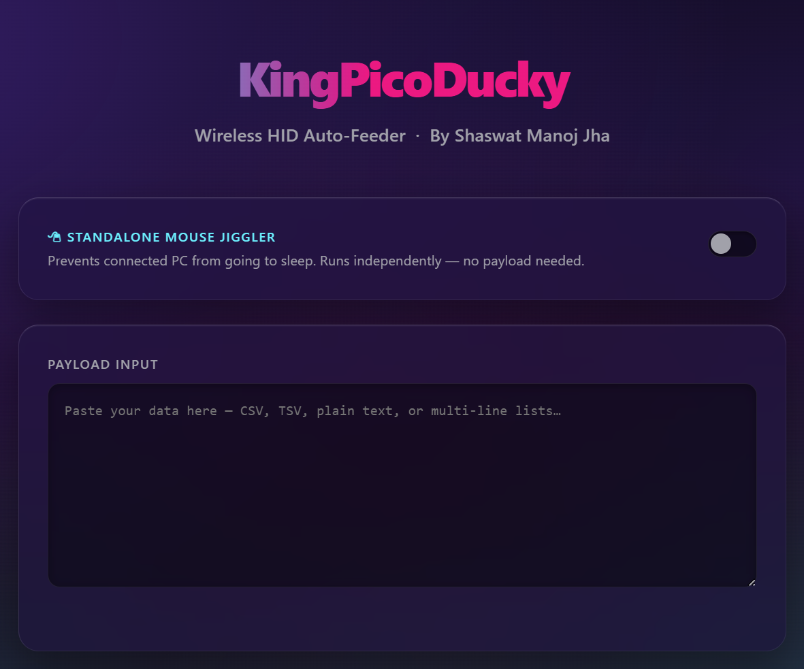
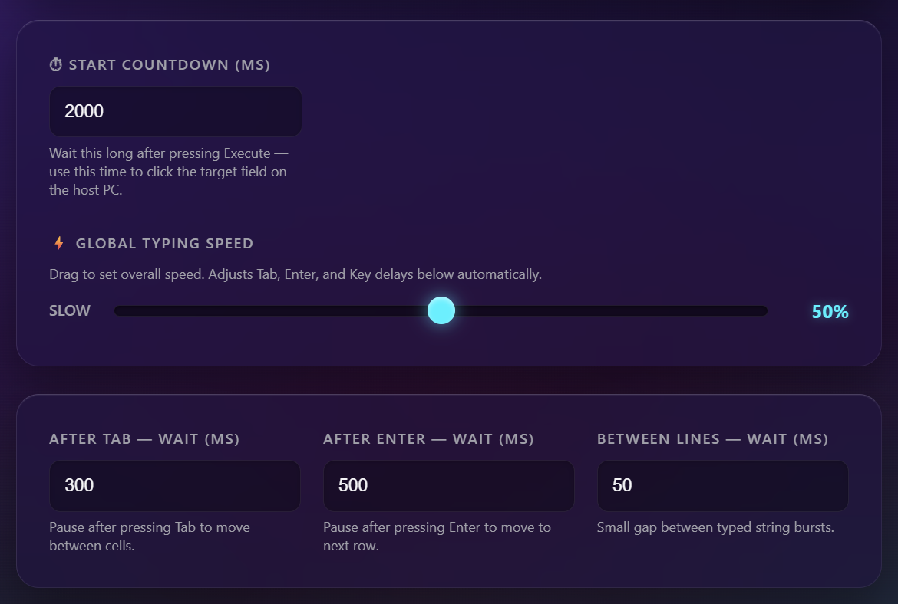
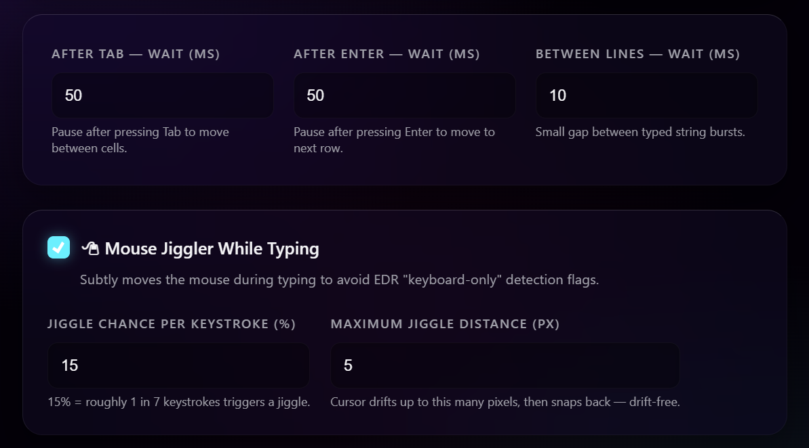
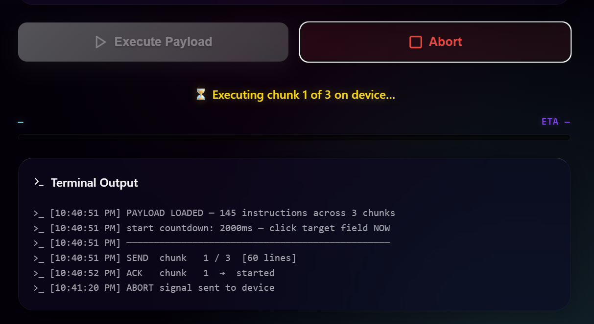
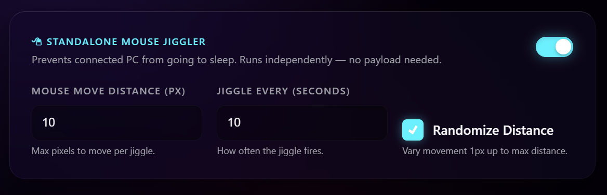

# KingPicoDucky (v2.0)

**The Ultimate Wireless HID Auto-Feeder for Raspberry Pi Pico W / Pico 2 W**
with integrated Mouse Jiggler.

Have you ever tried to paste a massive CSV into an old school "BadUSB" or Rubber Ducky, only to watch the microcontroller crash due to memory limits, or type faster than the target computer can handle? 

**KingPicoDucky** solves this. It allows you to paste enormous text documents, CSVs, or TSV spreadsheets straight into your browser. The board then types it directly into the target USB host, properly chunked, paced, and completely wirelessly.

Maintained by **KingShash** (Shaswat Manoj Jha).



---

## 📖 Contents

- [Why KingPicoDucky?](#why-kingpicoducky)
- [✨ Core Features & Design](#-core-features--design)
- [🔥 Advanced: EDR Evasion](#-advanced-edr-evasion-stealth)
- [💻 Hardware Requirements](#-hardware-requirements)
- [🚀 Beginner's Install Guide](#-beginners-install-guide)
- [🕹️ How to Use (Web Interface)](#%EF%B8%8F-how-to-use-web-interface)
- [⚙️ Advanced Settings & Tuning](#%EF%B8%8F-advanced-settings--tuning)
- [🧩 Mnemonic Script Reference](#-mnemonic-script-reference)
- [🔌 REST API Reference](#-rest-api-reference)
- [❓ Troubleshooting](#-troubleshooting)

---

## Why KingPicoDucky?

Many Ducky-style tools excel at *short* payloads (e.g., executing a quick Powershell command). However, they break down when dealing with heavy data entry due to:

1. **Buffer limits**: Sending thousands of lines of payload all at once overflows the tiny RAM on most microcontrollers, crashing the device.
2. **Timing issues**: Traditional scripts type extremely fast. Spreadsheets or web forms often "swallow" or skip characters if they're still rendering an animation from the previous `TAB` or `ENTER`.
3. **EDR Flags**: Typing thousands of characters perfectly spaced at 10 milliseconds without moving a mouse is instantly flagged by corporate Endpoint Detection and Response (EDR) agents.

**What this tool does differently:**
The KingPicoDucky acts as an isolated Access Point. You connect to it with your phone/laptop, paste your long list of data into the sleek Apple-style web interface, and the *browser* chunks it safely. The browser sends 60 lines at a time, waits for the Pico to finish, and sends the next block.

---

## ✨ Core Features & Design

* **Premium Cyberpunk Glassmorphism UI**: Dark-mode, animated gradient, frosted glass cards, neon glow — completely offline. No CDN, no internet needed.
* **Global Speed Slider**: One drag sets all delays simultaneously. Goes from "Slow & Safe" to "Absolute Boost". All fine-tuning fields still editable manually.
* **Chunked Ghost Feeder**: The browser splits huge payloads into 60-line chunks. Tracks live ETA, chunk progress, and per-chunk timing in a hacker-style terminal output. Stop at any time.
* **Standalone Anti-Sleep Mouse Jiggler**: Toggle-on to keep the target PC awake independently. Fully configurable distance, interval, and randomization. Runs even when not feeding a payload.
* **Mouse Jiggler While Typing**: Subtly moves the mouse during typing to evade EDR keyboard-only detection. Configurable jiggle chance per keystroke and max bounding distance.



---

## 🔥 Advanced: EDR Evasion & Stealth

Corporate environments now leverage advanced AI to detect "Anomalous Peripherals" and BadUSBs. Version 2.0 of KingPicoDucky provides complete mitigation against standard heuristic scans:

* **Hardware Fingerprinting**: Built into the `boot.py`, the CircuitPython `supervisor` mimics a legitimate **Dell USB Entry Keyboard** (VID: `0x413C`, PID: `0x2107`). By the time the host computer even probes the USB bus, it registers a completely mundane hardware device.
* **Behavioral Heuristics (Humanize Mode)**: Machine-perfect 10ms typing is flagged by EDRs. By checking **"Humanize typing"** in the interface, KingPicoDucky injects naturally varying delays: 
   * **20-60ms** standard typing.
   * **40-100ms** after spaces and tabs.
   * **150-400ms** longer pauses simulating human thought after punctuation and newlines.
   * **5% chance** to randomly pause and simulate a brief 'stumbling' hesitate.
* **Lack of Correlated Input**: EDRs look for keyboards that type thousands of characters with absolutely zero mouse movement. In **"Mouse Jiggler While Typing"** mode, KingPicoDucky uses the `adafruit_hid.mouse` library to shake the mouse slightly at random intervals, fulfilling the "correlated input" security requirement perfectly. You configure the jiggle *chance per keystroke (%)* and *maximum bounding distance (px)*. The board uses a **drift-free physics engine** — every outward movement is immediately cancelled with an exact negative return, so the cursor never drifts away during long runs.



---

## 💻 Hardware Requirements

1. **Raspberry Pi Pico W** or **Pico 2 W**.
2. **Micro-USB Data Cable** (charging-only cables will not work).
3. **Host Computer** (Target PC / Mac / Linux).
4. **Phone or Laptop** (to join the Pico's backend Wi-Fi terminal and control the feed).

---

## 🚀 Beginner's Install Guide

### Step 1: Flash standard CircuitPython
1. Download the [CircuitPython `.UF2` for the Pico W](https://circuitpython.org/board/raspberry_pi_pico_w/) or [Pico 2 W](https://circuitpython.org/board/raspberry_pi_pico2_w/). 
2. Unplug your Pico. **Hold down the `BOOTSEL` button** on the board, plug it into your computer, and let go of the button once the `RPI-RP2` drive appears.
3. Drag and drop the `.UF2` file onto the drive. It will reboot and reappear as a drive named `CIRCUITPY`.

### Step 2: Add essential libraries
CircuitPython needs the USB and Web Server add-ons. 
1. Download the [Adafruit CircuitPython Library Bundle](https://circuitpython.org/libraries) that matches your CircuitPython version (e.g. `9.x`).
2. Unzip it, go to the `lib` folder inside, and copy the `adafruit_hid` and `adafruit_httpserver` folders.
3. Paste both into the `lib` folder on your `CIRCUITPY` drive.

### Step 3: Copy this Project
1. Copy the `boot.py`, `code.py`, and `network.conf` files from this repository directly into the root of `CIRCUITPY`.
2. Create a folder called `static` on `CIRCUITPY`.
3. Drop `index.html`, `styles.css`, and `script.js` into that `static` folder.

### Step 4: Configure the Wi-Fi
Open `network.conf` and update the credentials for the network the Pico will *broadcast*:
```ini
ssid="PicoDuckyNet"
password="Password123"
ip="192.168.4.1"
```

Save, and reset the Pico (unplug and re-plug it). 

---

## 🕹️ How to Use (Web Interface)

1. Plug the Pico into the **target** computer. 
2. On your **phone or second PC**, join the Wi-Fi network you set up in `network.conf` (`PicoDuckyNet`). 
3. Open your browser and go to `http://192.168.4.1/`. You'll see the futuristic Glassmorphism KingPicoDucky dashboard.
4. **Optional — Enable Standalone Jiggler**: If you want to keep the target PC awake while you set up, flip the **Standalone Mouse Jiggler** toggle at the top.
5. **Paste your Data or Script**: Take a massive Excel file column or thousands of lines of text and paste it into the Payload Input. Alternatively, enable the **⌨ Direct Mnemonic Script** toggle and type raw HID instructions (see [Mnemonic Script Reference](#-mnemonic-script-reference) below).
6. **Set Speed**: Drag the **Global Typing Speed** slider or manually tune the TAB/ENTER/Key delay fields below it.
7. **Optionally enable Mouse Jiggler While Typing**: If the target environment uses EDR, turn this on. You can control how often and how far the mouse jiggles.
8. **Hit "Execute Payload"**: The tool will begin automatically typing everything onto the Target PC. Watch the hacker-style Terminal Output, chunk counter, and live ETA!





---

## ⚙️ Advanced Settings & Tuning

### The "Stealth" `boot.py` Switch
Included inside `boot.py` is logic to hide the USB mass-storage drive entirely from the target computer. If you have a physical switch wired between **GP17** and Ground, and the switch is OPEN, the `CIRCUITPY` drive will disappear, leaving only the "Dell Keyboard" registered. The drive will also optionally mount under the generic name `KINGSHASH` for further disguise.

### Field Delays Explained
- **Start Countdown (ms)**: The board waits this long after you press Execute before typing begins. Use this time to click the exact form field or spreadsheet cell on the target PC. Default `2000ms` (2 seconds).
- **Global Speed Slider**: Drag to 100% for **Absolute Boost** (Tab/Enter `50ms`, Key `10ms`). Drag to 0% for a very conservative `1500ms` Enter gaps for slow hosts. All fields below update live.
- **After TAB — Wait (ms)**: Pause after pressing Tab to let the host PC move focus to the next cell. Increase if the host is slow or the form has lazy rendering.
- **After ENTER — Wait (ms)**: Pause after pressing Enter to let the host move to the next row. High values (800ms+) recommended for complex spreadsheets.
- **Between Lines — Wait (ms)**: Additional pause between typed string segments on the same row.

### Standalone Mouse Jiggler
Enable from the toggle at the top of the UI. Expand the config to set:
- **Mouse Move Distance (px)**: Max pixels the cursor moves per jiggle (1–127px). Returns immediately — invisible to user.
- **Jiggle Every (seconds)**: Interval in seconds between jiggles.
- **Randomize Distance**: When checked, jiggle distance is random from 1px up to the max set. When unchecked, always moves the exact distance set.

### Mouse Jiggler While Typing (EDR Evasion)
- **Jiggle Chance per Keystroke (%)**: Probability that any given typed character will trigger a mouse movement. 15% = roughly every 7th key.
- **Maximum Jiggle Distance (px)**: Hard cap in pixels for the jiggle. Drift-free — the board tracks every move and snaps back automatically.

---

## 🧩 Mnemonic Script Reference

KingPicoDucky supports a simple, line-based HID scripting language. You can write scripts directly in the Payload Input by enabling the **⌨ Direct Mnemonic Script** toggle — instructions are sent to the Pico as-is, bypassing the auto-wrapping that normal text paste uses.

### Instructions

| Instruction | Example | Description |
|---|---|---|
| `TYPE <text>` | `TYPE Hello World` | Types the given text as keyboard output. |
| `WAIT <ms>` | `WAIT 500` | Pauses execution for the given number of milliseconds. |
| `ENTER` | `ENTER` | Presses the Enter / Return key. |
| `TAB` | `TAB` | Presses the Tab key. |
| `SPACE` | `SPACE` | Presses the Space key. |
| `BKSP` | `BKSP` | Presses Backspace. |
| `DEL` | `DEL` | Presses Delete. |
| `INSERT` | `INSERT` | Presses Insert. |
| `ESC` | `ESC` | Presses Escape. |
| `CAPS` | `CAPS` | Toggles Caps Lock. |
| `<MODIFIER> <KEY>` | `CTRL C` | Holds modifier + presses key (chord). |
| `GUI R` | `GUI R` | Opens the Run dialog on Windows (Win+R). |
| `F1` – `F12` | `F5` | Presses the corresponding function key. |
| Arrow keys | `LEFT` / `RIGHT` / `UP` / `DOWN` | Presses the corresponding arrow key. |
| `HOME` / `END` | `HOME` | Presses Home or End. |
| `PGUP` / `PGDN` | `PGUP` | Presses Page Up or Page Down. |
| `PRTSCR` | `PRTSCR` | Presses Print Screen. |
| `PAUSE` | `PAUSE` | Presses Pause / Break. |
| `NUM` | `NUM` | Toggles Num Lock. |
| `SCROLL` | `SCROLL` | Toggles Scroll Lock. |
| `APP` | `APP` | Presses the Application / Menu key. |
| `LOOP <n>` / `EXIT` | `LOOP 3` … `EXIT` | Repeats the enclosed block `n` times. |
| `INF` / `EXIT` | `INF` … `EXIT` | Repeats the enclosed block forever (until aborted). |

### Modifier Keys (for chords)

| Mnemonic | Key |
|---|---|
| `CTRL` | Left Control |
| `SHIFT` | Left Shift |
| `ALT` | Left Alt |
| `GUI` | Windows / Command / Super |

> **Tip:** Modifiers and keys can be chained on a single line for combos: `CTRL SHIFT ESC` opens Task Manager on Windows.

### Example Script

```
WAIT 2000
GUI R
WAIT 500
TYPE notepad
ENTER
WAIT 1000
TYPE Hello from KingPicoDucky!
ENTER
CTRL S
```

---

## 🔌 REST API Reference

If you want to build automated tools to interact with your PicoDucky, here are the endpoints:

| Method | Path | Purpose |
|--------|------|---------|
| `POST` | `/execute` | Run one chunk (`{"content": "LINE\nLINE...", "humanize": false, "hz_freq": 0.15, "hz_px": 2}`). |
| `POST` | `/jiggler` | Configures and toggles the standalone mouse jiggler (`{"enabled": true, "distance": 10, "interval": 10}`). |
| `POST` | `/stop` | Request cooperative abort of current run. |
| `GET` | `/status` | Returns JSON status: `busy`, `abort`. |
| `GET` | `/` | Web UI assets. |

---

## ❓ Troubleshooting

| Symptom | Solution |
|---------|----------------|
| **Can't access `http://192.168.4.1/`** | Ensure your phone/device is completely connected to the Pico's Wi-Fi. Turn off Cellular Data temporarily if your phone drops WiFi connections without internet. |
| **`ImportError` flashing on serial** | You forgot to place the `adafruit_hid` or `adafruit_httpserver` directories inside the `lib` folder of the Pico. |
| **Random letters missing during typing** | The USB Target computer is lagging behind the Pico! Increase the **Key delay** or **Tab / Enter** parameters in the UI significantly! |

---

*This project is for educational use and authorized auditing only. Unauthorized Keystroke injection is illegal.*
