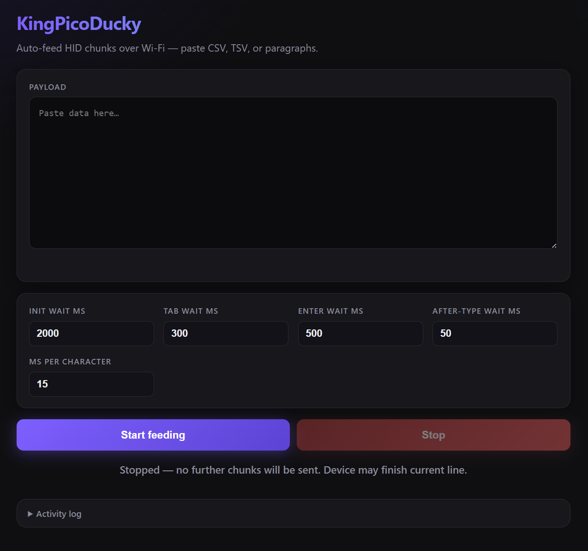

# KingPicoDucky

**Wireless HID auto-feeder for Raspberry Pi Pico W / Pico 2 W** — paste large CSV, TSV, or plain text in the browser; the board types it into the host over USB, without blowing past tiny MCU RAM limits.

Maintained by **KingShash** (Shaswat Manoj Jha).

---

## Contents

- [Why this exists](#why-this-exists)
- [What it does](#what-it-does)
- [Features](#features)
- [Web interface](#web-interface)
  - [Ms per character](#ms-per-character-tuning)
- [Hardware](#hardware)
- [Install guide](#install-guide)
  - [Step 1: Flash standard CircuitPython](#step-1-flash-standard-circuitpython)
  - [Step 2: Add required libraries](#step-2-add-required-libraries)
  - [Step 3: Copy this project](#step-3-copy-this-project)
  - [Step 4: Configure Wi-Fi](#step-4-configure-wi-fi)
- [How to use](#how-to-use)
- [Optional: boot.py stealth mode](#optional-bootpy-stealth-mode)
- [REST endpoints (reference)](#rest-endpoints-reference)
- [Troubleshooting](#troubleshooting)
- [Repository layout](#repository-layout)

---

## Why this exists

Many BadUSB / Ducky-style tools are built for **short** payloads (dozens of lines). That breaks down when you need **heavy** data entry:

| Issue | What goes wrong |
|--------|------------------|
| **Buffer limits** | Long scripts in one HTTP request can overflow RAM or get truncated; the web server or interpreter crashes. |
| **Timing** | Typing too fast into Excel or web forms causes the host to **drop characters** (especially after `TAB` / `ENTER` while the UI is still animating). |
| **CSV ergonomics** | You do not want to prefix every cell line with `STRING` / `TYPE` by hand for hundreds of rows. |

---

## What it does

KingPicoDucky keeps **CircuitPython on the board** doing what it does best (USB HID + small HTTP handler), and moves **splitting, pacing, and queueing** into the **browser**:

1. You paste raw text or spreadsheet data (tab-separated works like Excel copy/paste).
2. The page builds a Ducky-style script (`TYPE`, `TAB`, `ENTER`, `WAIT`, …).
3. The script is sent in **small chunks** (default 60 lines per request) so the Pico never sees a monster payload at once.
4. The UI **estimates** how long each chunk will take to type and **waits** before sending the next chunk, reducing “swallowed” keystrokes.
5. You can **stop** feeding: the browser aborts the current request and the firmware cooperatively stops between lines and during `WAIT` delays.

No custom UF2 fork is required — **official CircuitPython** only, plus two libraries from the Adafruit bundle.

---

## Features

- **Chunked “ghost feeder”** — Browser-side slicing; Pico gets bounded line counts per request.
- **Tunable delays** — Separate waits after init, `TAB`, row/`ENTER`, and per cell type; configurable ms-per-character for timing estimates.
- **Live preview** — Row count, generated script line count, chunk count, and rough total time before you start.
- **Progress + activity log** — Chunk index, send/wait phases, and timestamped log lines.
- **Stop** — Client abort + `POST /stop` so typing stops cooperatively on the device.
- **`GET /status`** — `busy` / `abort` for debugging or future tooling.
- **Standard stack** — `adafruit_hid` + `adafruit_httpserver` on stock CircuitPython.

---

## Web interface

Dark, single-page UI served from the Pico. Open it from a phone or laptop on the same Wi‑Fi network as the board’s access point.



### Layout and controls

| Area | What it does |
|------|----------------|
| **Header** | Title and short subtitle (CSV / TSV / paragraphs over Wi‑Fi). |
| **Payload** | Large monospace field where you paste data. Tab-separated rows behave like Excel copy/paste (tabs move across cells, newlines move down rows). Empty lines still send `ENTER`. |
| **Live preview** (under payload) | Updates as you type or change settings: **row count**, **generated script line count**, **number of HTTP chunks** (60 script lines per chunk), and a **rough total duration** estimate. |
| **Init wait (ms)** | Inserts a leading `WAIT` before any keys. Gives you time to click into the target window after pressing Start. |
| **Tab wait (ms)** | Pause after each `TAB` (moving to the next cell). Helps spreadsheets and forms finish focus moves before the next character. |
| **Enter wait (ms)** | Pause after each row’s `ENTER` (new line in the sheet or document). |
| **After-type wait (ms)** | Pause after each `TYPE …` line (each cell’s text). Adds breathing room before `TAB`/`ENTER`. |
| **Ms per character** | Used **only in the browser** to schedule pauses between chunks — see [below](#ms-per-character-tuning). |
| **Start feeding** | Builds the script, splits it into chunks, `POST`s each chunk to `/execute`, and waits between chunks using the timing model. Disabled while a run is active. |
| **Stop** | Aborts the in-flight request, tells the firmware to stop via `POST /stop`, and cancels inter-chunk waits early. Enabled only while feeding. |
| **Status line** | Plain-language state: idle, per-chunk progress (send vs wait), success, stop, or network error. Marked for screen readers (`role="status"`). |
| **Progress bar** | Fills as each chunk completes; hidden when idle. |
| **Activity log** | Collapsible (`<details>`), open by default. Timestamped lines: start, each chunk POST, device reply (`done` / `aborted`), stop requests, errors. Scrolls to the latest line. |
| **Sanitization** | Non-ASCII characters are stripped before sending (smart quotes/dashes normalized where possible) so the US keyboard layout on the Pico does not mis-type. |

### Ms per character tuning

**Important:** This number does **not** insert a delay between every key inside CircuitPython. On the board, `TYPE` lines are sent with `KeyboardLayoutUS.write()` as fast as USB and the firmware allow.

**What it actually does:** For each chunk, the page estimates duration as:

- sum of every explicit **`WAIT`** in that chunk (from your ms fields), **plus**
- **(number of characters in all `TYPE` lines in that chunk) × (ms per character)**, **plus**
- a fixed **~2.5 s** cushion per chunk.

That total is how long the browser **waits after posting a chunk** before sending the next one. So **ms per character** is a **scheduling knob**: it should be large enough that the Pico has usually **finished typing the current chunk** before the next HTTP request arrives. If it is too **small**, the next chunk can start while the host is still catching up → dropped or merged characters. If it is too **large**, feeding is simply slower than necessary.

**Starting points (tune by watching the host):**

| Situation | Try (ms per character) |
|-----------|-------------------------|
| Fast PC, light forms, default | **12–18** (repo default in `index.html` is **15**) |
| Excel / heavy UI, remote desktop, or older hardware | **20–35** |
| Still seeing swallowed first characters after raising Tab/Enter/After-type waits | **Increase ms per character** in steps of 3–5 until stable |

**How to verify:** If the activity log shows the next chunk sending while the host is still printing the previous cell, increase **ms per character** (or the per-field **WAIT** values) until chunks visibly finish before the next wave starts.

---

## Hardware

| Item | Notes |
|------|--------|
| **Board** | [Raspberry Pi Pico W](https://www.raspberrypi.com/products/pico-w/) or [Pico 2 W](https://www.raspberrypi.com/products/pico-2-w/) |
| **USB cable** | Must support **data** (charge-only cables will not work). |
| **Host PC** | Machine that should receive keystrokes (Windows / macOS / Linux). |
| **Phone / laptop** | Any Wi‑Fi client that can join the Pico’s access point to open the control page. |

**Optional — stealth / mass-storage:** `boot.py` can hide the `CIRCUITPY` USB drive from the **host** when a switch on **GP17** is open (see [below](#optional-bootpy-stealth-mode)). The drive may appear under the label **`KINGSHASH`** after remount logic.

---

## Install guide

Use **official CircuitPython** from [circuitpython.org](https://circuitpython.org/downloads). Do not rely on unknown prebuilt “all-in-one” UF2 images for this project.

### Step 1: Flash standard CircuitPython

1. **Download the `.uf2` for your exact board** (pick one):

   | Board | Official download page |
   |-------|-------------------------|
   | **Raspberry Pi Pico W** | [**Download / board info — Pico W**](https://circuitpython.org/board/raspberry_pi_pico_w/) |
   | **Raspberry Pi Pico 2 W** | [**Download / board info — Pico 2 W**](https://circuitpython.org/board/raspberry_pi_pico2_w/) |

   On each page, use the **Download .UF2 now** button (or the latest release linked there).  
   *Tip:* the [main downloads page](https://circuitpython.org/downloads) lists all boards if you need to search.

2. **Enter bootloader mode**
   - Unplug the Pico.
   - **Hold `BOOTSEL`**, plug the USB cable into your computer, then **release `BOOTSEL`** after a second or two.

3. **Copy the firmware**
   - A USB drive should appear — often **`RPI-RP2`** on RP2040 (Pico W). On **RP2350** (Pico 2 / Pico 2 W) you may see **`RP2350`** instead; behavior is the same: it is the bootloader volume.
   - **Drag and drop** the downloaded `.uf2` onto that drive.
   - The volume will eject and the board will reboot.

4. **Confirm success**
   - The board comes back as **`CIRCUITPY`** with `code.py` and empty folders — that is your CircuitPython disk.

5. **Version check**
   - Open `boot_out.txt` on `CIRCUITPY` and note the **CircuitPython version** (e.g. `9.x.x`). You need the **matching** library bundle major version in Step 2.

---

### Step 2: Add required libraries

Standard CircuitPython does not ship with USB HID typing helpers or the HTTP server in `lib`; add them from the **Adafruit CircuitPython Library Bundle**.

1. **Download the bundle**  
   [**CircuitPython libraries — get the bundle**](https://circuitpython.org/libraries)  

   Download the **`.zip` whose version matches your firmware** (e.g. **9.x** bundle for CircuitPython 9.x, **8.x** for 8.x). Mixing major versions often causes import errors.

2. **Extract** the zip on your computer.

3. **Open the extracted `lib` folder** inside the bundle. Copy **these two folders** (entire folders, not single files):

   | Folder | Role |
   |--------|------|
   | `adafruit_hid` | USB keyboard / layout (keystrokes and typing). |
   | `adafruit_httpserver` | HTTP server for the web UI and `/execute` API. |

4. On **`CIRCUITPY`**, open the **`lib`** folder (create it if it is missing). **Paste** both folders there.

5. **If you get `ImportError` on boot**  
   Some versions pull in extra dependencies. Check the `requirements.txt` next to each library in the bundle and copy any **additional** listed packages from the same bundle’s `lib` folder into `CIRCUITPY/lib`. Retry until `code.py` runs without errors in the serial console.

---

### Step 3: Copy this project

1. Copy from this repository to the **root** of `CIRCUITPY`:
   - `code.py`
   - `boot.py` *(optional; see [stealth mode](#optional-bootpy-stealth-mode))*
   - `network.conf` *(you will edit credentials in Step 4)*

2. Create a folder named **`static`** on `CIRCUITPY`.

3. Copy into **`static/`**:
   - `index.html`
   - `script.js`
   - `styles.css`

Your `CIRCUITPY` layout should match [Repository layout](#repository-layout) below.

---

### Step 4: Configure Wi-Fi

Edit **`network.conf`** on the root of the drive (plain text, `key=value`):

```ini
ssid="YourNetworkName"
password="YourNetworkPassword"
ip="192.168.4.1"
```

- **`ssid` / `password`** — Access point the Pico will create. Clients join this network to open the web UI.
- **`ip`** — IPv4 address of the Pico on that AP (default `192.168.4.1` matches common phone hotspot patterns; change if it clashes).

Save the file, then **reset** the board (unplug/replug or Ctrl+D in the REPL).

---

## How to use

1. Plug the Pico into the **target computer** (USB HID).
2. On your **phone or second PC**, join the Wi‑Fi network named like your `ssid` in `network.conf`.
3. Open a browser to **`http://`** plus the `ip` from `network.conf` (default **`http://192.168.4.1/`**).
4. Paste data, adjust timing fields if needed, then **Start feeding**. Use **Stop** to halt further chunks and signal the firmware to stop cooperatively.
5. Focus the correct window on the host before typing starts (same as any USB keyboard).

The web UI uses **`http://192.168.4.1`** as a fallback when the page is not opened from the Pico’s own origin; if you changed `ip`, either open the page via that address or edit `script.js` (`base` constant) to match.

---

## Optional: boot.py stealth mode

`boot.py` remounts the filesystem read-only, sets the volume label to **`KINGSHASH`**, and — if **GP17** is **not** pulled to ground — calls `storage.disable_usb_drive()` so the **USB mass-storage drive is hidden from the host** (the host still sees the HID keyboard).  

If you do not need that behavior, you can remove or rename `boot.py` and keep only `code.py` and `static/`.

---

## REST endpoints (reference)

| Method | Path | Purpose |
|--------|------|---------|
| `POST` | `/execute` | Run one chunk of script (`JSON`: `{"content": "LINE\\nLINE..."}`). |
| `POST` | `/stop` | Request cooperative abort of current run. |
| `GET` | `/status` | JSON: `busy`, `abort`. |
| `GET` / `POST` | `/`, `/index.html`, `/styles.css`, `/script.js` | Web UI assets. |

---

## Troubleshooting

| Symptom | Things to try |
|---------|----------------|
| No `CIRCUITPY` after flashing | Re-enter BOOTSEL mode; try another USB port/cable; confirm UF2 matches **Pico W** vs **Pico 2 W**. |
| `ImportError` in serial console | Re-copy libraries from the bundle version that **matches** your CP major version; add missing deps from bundle `requirements.txt`. |
| Cannot open web page | Join the Pico’s AP; ping or browse `http://<ip>/`; confirm `network.conf` quotes and `ip`. |
| Garbled or missing keys | Increase **Tab / Enter / type** waits and **ms per character**; slow hosts and spreadsheets need more delay. |
| “Device busy” / stuck | Only one `/execute` at a time; use **Stop**, reset the board, check `/status`. |

---

## Repository layout

```text
KingPicoDucky/
├── README.md
├── docs/
│   └── web-ui.png          # screenshot for README
├── boot.py                 # optional: stealth / drive label
├── code.py                 # Wi‑Fi AP, HTTP server, HID engine
├── network.conf            # AP ssid, password, board IP
└── static/
    ├── index.html          # web UI shell
    ├── script.js           # chunking, timing, fetch + stop
    └── styles.css          # UI styles
```

**On `CIRCUITPY` after install** (same tree; `lib/` added by you):

```text
CIRCUITPY/   (or KINGSHASH)
├── boot.py
├── code.py
├── network.conf
├── lib/
│   ├── adafruit_hid/
│   └── adafruit_httpserver/
└── static/
    ├── index.html
    ├── script.js
    └── styles.css
```

---

## License and responsibility

Use this project **only on systems you own or are explicitly authorized to test**. Unauthorized keystroke injection is illegal in many jurisdictions. The authors are not responsible for misuse.

---

*Questions or improvements — open an issue or PR on the repository hosting this file.*
